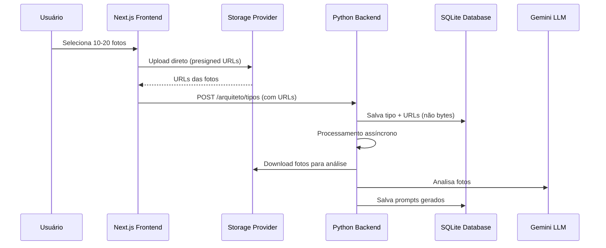

# Plano: Upload Di

reto para Storage

## Objetivo

Migrar o armazenamento de fotos de referência de BLOB no banco SQLite para storage externo (S3, Cloudinary, Vercel Blob, etc.), permitindo upload direto do frontend e evitando limites de tamanho da Vercel.

## Arquitetura




## Mudanças Necessárias

### 1. Modelo de Banco de Dados

**Arquivo:** `mrv-ai-preview-back/utils/database/architect_models.py`

- **Mudança:** Substituir campo `foto_data` (BLOB) por `foto_url` (String)
- **Adicionar:** Campo `storage_provider` (opcional, para rastreamento)
- **Manter:** Campos `tamanho_bytes`, `formato`, `ordem` para metadados
```python
# Antes:
foto_data = Column(BLOB, nullable=False)

# Depois:
foto_url = Column(String(500), nullable=False, index=True)
storage_provider = Column(String(50), nullable=True)  # 's3', 'cloudinary', etc.
```


**Migração:** Criar script de migração para dados existentes (se houver)

### 2. Serviço de Storage (Novo)

**Arquivo:** `mrv-ai-preview-back/utils/storage/storage_service.py` (criar novo)**Responsabilidades:**

- Gerar presigned URLs para upload direto do frontend
- Validar uploads (tamanho, formato)
- Baixar fotos do storage para processamento LLM
- Deletar fotos quando tipo pessoal for deletado

**Interface genérica:**

```python
class StorageService:
    def generate_upload_url(self, filename: str, content_type: str) -> str
    def download_file(self, url: str) -> bytes
    def delete_file(self, url: str) -> bool
    def validate_upload(self, file: bytes) -> bool
```

**Implementações específicas:**

- `s3_storage.py` - AWS S3 / DigitalOcean Spaces
- `cloudinary_storage.py` - Cloudinary
- `vercel_blob_storage.py` - Vercel Blob

### 3. Frontend - Upload Direto

**Arquivo:** `mrv-ai-preview-front/components/create-personal-type.tsx`**Mudanças:**

1. **Nova função:** `uploadPhotosToStorage()` - Upload direto para storage
2. **Modificar:** `handleSubmit()` - Enviar URLs ao invés de FormData com arquivos
3. **Adicionar:** Progress tracking para uploads múltiplos
4. **Adicionar:** Retry logic para uploads falhados

**Fluxo:**

```typescript
// 1. Obter presigned URLs do backend
const uploadUrls = await fetch('/api/architect/upload-urls', {
  method: 'POST',
  body: JSON.stringify({ count: fotos.length })
})

// 2. Upload direto para storage (paralelo)
const uploadPromises = fotos.map((photo, index) => 
  fetch(uploadUrls[index], {
    method: 'PUT',
    body: photo.file,
    headers: { 'Content-Type': photo.file.type }
  })
)

// 3. Aguardar todos os uploads
await Promise.all(uploadPromises)

// 4. Enviar URLs para backend
await fetch('/api/architect/types', {
  method: 'POST',
  body: JSON.stringify({ nome, foto_urls: uploadUrls })
})
```


### 4. Nova API Route - Presigned URLs

**Arquivo:** `mrv-ai-preview-front/app/api/architect/upload-urls/route.ts` (criar novo)**Responsabilidade:** Gerar presigned URLs para upload direto**Fluxo:**

1. Receber quantidade de fotos
2. Chamar backend Python para gerar presigned URLs
3. Retornar URLs para frontend

### 5. Backend - Rotas API

**Arquivo:** `mrv-ai-preview-back/utils/api/routes/architect.py`**Mudanças:a) Nova rota:** `POST /arquiteto/upload-urls`

- Gerar presigned URLs para upload direto
- Retornar lista de URLs temporárias

**b) Modificar:** `POST /arquiteto/tipos`

- **Antes:** Receber `fotos: List[UploadFile]`
- **Depois:** Receber `foto_urls: List[str]`
- Validar URLs antes de salvar
- Salvar URLs no banco (não bytes)

**c) Modificar:** `processar_tipo_assincrono()`

- Baixar fotos do storage antes de analisar
- Processar normalmente após download

**d) Modificar:** `DELETE /arquiteto/tipos/{tipo_id}`

- Deletar fotos do storage antes de deletar do banco

### 6. Serviço de Banco - Atualizar

**Arquivo:** `mrv-ai-preview-back/utils/database/architect_service.py`**Mudanças:a) `create_personal_type()`:**

- **Antes:** `fotos_bytes: List[tuple]` → salvar BLOB
- **Depois:** `foto_urls: List[str]` → salvar URLs

**b) Nova função:** `download_fotos_para_analise()`

- Baixar fotos do storage
- Retornar bytes para análise LLM

### 7. Variáveis de Ambiente

**Arquivos:** `.env` (frontend e backend)**Adicionar:**

```bash
# Storage Configuration
STORAGE_PROVIDER=s3|cloudinary|vercel_blob
STORAGE_BUCKET=your-bucket-name
STORAGE_REGION=us-east-1
STORAGE_ACCESS_KEY=your-access-key
STORAGE_SECRET_KEY=your-secret-key

# Para Cloudinary
CLOUDINARY_CLOUD_NAME=your-cloud-name
CLOUDINARY_API_KEY=your-api-key
CLOUDINARY_API_SECRET=your-api-secret
```


### 8. Processamento Assíncrono

**Arquivo:** `mrv-ai-preview-back/utils/api/routes/architect.py`**Modificar:** `processar_tipo_assincrono()`**Novo fluxo:**

1. Buscar URLs do banco
2. Baixar fotos do storage
3. Analisar com LLM
4. Salvar prompts
5. (Opcional) Deletar fotos temporárias do storage após análise

### 9. Migração de Dados (Se necessário)

**Arquivo:** `mrv-ai-preview-back/migrations/migrate_blob_to_storage.py` (criar novo)**Responsabilidade:** Migrar fotos existentes de BLOB para storage

- Ler fotos do banco
- Upload para storage
- Atualizar URLs no banco
- Validar migração

## Ordem de Implementação

1. **Fase 1: Infraestrutura de Storage**

- Criar `storage_service.py` com interface genérica
- Implementar provider escolhido (S3, Cloudinary, etc.)
- Configurar variáveis de ambiente

2. **Fase 2: Backend - Modelo e Serviços**

- Atualizar modelo `TypeReferencePhoto` (BLOB → URL)
- Criar migração de banco
- Atualizar `architect_service.py` para trabalhar com URLs
- Criar rota `/arquiteto/upload-urls`

3. **Fase 3: Backend - Rotas API**

- Modificar `POST /arquiteto/tipos` para receber URLs
- Atualizar `processar_tipo_assincrono()` para baixar fotos
- Atualizar `DELETE` para limpar storage

4. **Fase 4: Frontend - Upload Direto**

- Criar rota `/api/architect/upload-urls`
- Modificar `create-personal-type.tsx` para upload direto
- Adicionar progress tracking e error handling

5. **Fase 5: Testes e Validação**

- Testar upload direto
- Testar processamento assíncrono
- Validar limpeza de storage
- Testar com diferentes providers

6. **Fase 6: Migração (Se necessário)**

- Executar script de migração de dados existentes
- Validar integridade dos dados

## Considerações Importantes

### Segurança

- Presigned URLs com expiração (15-30 minutos)
- Validação de tipo de arquivo no storage
- Validação de tamanho antes do upload
- CORS configurado corretamente no storage

### Performance

- Upload paralelo de múltiplas fotos
- Retry automático para uploads falhados
- Cache de presigned URLs (se aplicável)

### Custos

- Monitorar uso de storage
- Implementar lifecycle policies (deletar fotos antigas)
- Considerar compressão antes do upload

### Fallback

- Manter código antigo comentado por um período
- Implementar feature flag para alternar entre BLOB e Storage
- Logs detalhados para debugging

## Arquivos a Modificar/Criar

### Criar:

- `mrv-ai-preview-back/utils/storage/storage_service.py`
- `mrv-ai-preview-back/utils/storage/s3_storage.py` (ou provider escolhido)
- `mrv-ai-preview-front/app/api/architect/upload-urls/route.ts`
- `mrv-ai-preview-back/migrations/migrate_blob_to_storage.py` (se necessário)

### Modificar:

- `mrv-ai-preview-back/utils/database/architect_models.py`
- `mrv-ai-preview-back/utils/database/architect_service.py`
- `mrv-ai-preview-back/utils/api/routes/architect.py`
- `mrv-ai-preview-front/components/create-personal-type.tsx`
- `mrv-ai-preview-front/app/api/architect/types/route.ts`

### Configuração:

- `.env` (frontend e backend)
- `requirements.txt` ou `pyproject.toml` (adicionar SDK do storage)

## Dependências Adicionais

**Backend:**

- `boto3` (para S3)
- `cloudinary` (para Cloudinary)
- `@vercel/blob` (para Vercel Blob)

**Frontend:**

- Nenhuma adicional (usa fetch nativo)

## Estimativa de Esforço

- **Fase 1:** 2-3 horas
- **Fase 2:** 3-4 horas