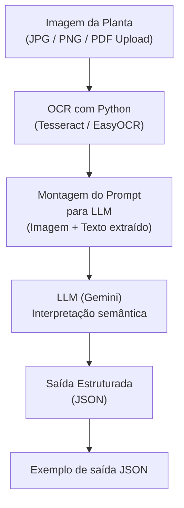

# mrv-house-plan-preview

```mermaid
flowchart TD
    A["Imagem da Planta\n(JPG / PNG / PDF Upload)"] --> B["OCR com Python\n(Tesseract / EasyOCR)"]
    B --> C["Montagem do Prompt\npara LLM\n(Imagem + Texto extraído)"]
    C --> D["LLM (Gemini)\nInterpretação semântica"]
    D --> E["Saída Estruturada\n(JSON)"]
    E --> F["Exemplo de saída JSON"]

```
