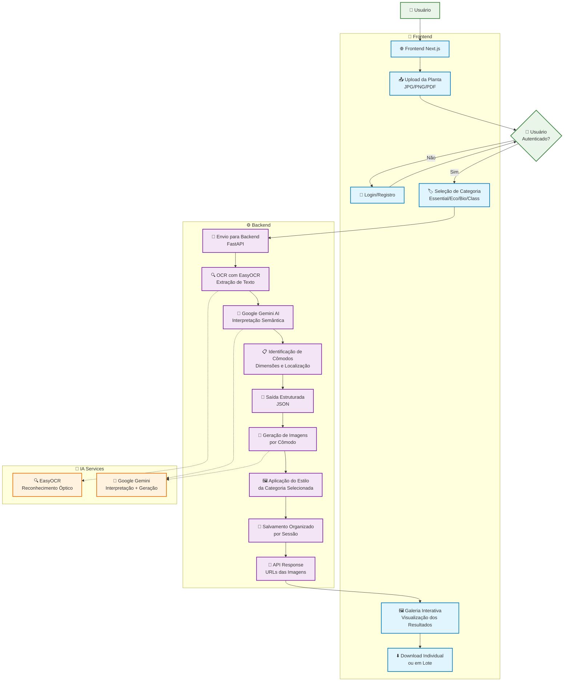

# 🏠 House AI Preview

> Transforme plantas arquitetônicas em previews realistas de apartamentos usando Inteligência Artificial

## 📋 Visão Geral

O **House AI Preview** é uma plataforma completa que utiliza inteligência artificial para converter plantas baixas em visualizações fotorrealistas de apartamentos. O sistema combina OCR, processamento de linguagem natural e geração de imagens para criar previews impressionantes em diferentes categorias de acabamento.

## 🏗️ Arquitetura do Sistema



## 🚀 Funcionalidades

### Frontend (Next.js)
- 🏠 **Landing Page Moderna**: Interface responsiva e atrativa
- 🔐 **Sistema de Autenticação**: Login/registro seguro com JWT
- 📱 **Design Responsivo**: Otimizado para todos os dispositivos
- 🎨 **Upload Intuitivo**: Drag & drop para plantas baixas
- 🏷️ **Categorias de Apartamentos**: Essential, Eco, Bio, Class
- 🖼️ **Galeria de Resultados**: Visualização organizada das imagens

### Backend (FastAPI)
- 🔍 **OCR Inteligente**: Extração de texto usando EasyOCR
- 🤖 **Interpretação IA**: Análise semântica via Google Gemini
- 🎨 **Geração de Imagens**: Criação de previews em alta definição
- 👥 **API Segura**: Endpoints protegidos com autenticação JWT
- 📁 **Gestão de Arquivos**: Organização automática por sessões

## 🛠️ Stack Tecnológico

### Frontend
- **Framework**: Next.js 14 (React 18)
- **Linguagem**: TypeScript
- **Estilização**: Tailwind CSS
- **Componentes**: Radix UI
- **Autenticação**: JWT + Context API

### Backend  
- **Framework**: FastAPI (Python 3.12+)
- **IA**: Google Gemini AI
- **OCR**: EasyOCR
- **Banco de Dados**: SQLite/PostgreSQL
- **Autenticação**: JWT + SQLAlchemy

### DevOps
- **Containerização**: Docker + Docker Compose
- **Deploy**: Standalone builds
- **Proxy**: Nginx (produção)

## 📁 Estrutura do Projeto

```
house-ai-preview/
├── mrv-ai-preview-front/     # Frontend Next.js
│   ├── app/                  # App Router
│   ├── components/           # Componentes React
│   ├── hooks/               # Custom hooks
│   ├── lib/                 # Utilitários
│   └── public/              # Assets estáticos
├── mrv-ai-preview-back/      # Backend FastAPI
│   ├── utils/               # Módulos organizados
│   │   ├── api/            # Rotas da API
│   │   ├── auth/           # Autenticação
│   │   ├── core/           # Lógica de negócio
│   │   └── database/       # Modelos de dados
│   ├── generated_images/    # Imagens geradas
│   └── main.py             # Entrada da aplicação
└── README.md               # Documentação principal
```

## 🏷️ Categorias de Apartamentos

### Essential
- **Estilo**: Moderno e funcional
- **Público**: Jovens profissionais, primeira habitação
- **Características**: Design clean, acabamentos de qualidade

### Eco
- **Estilo**: Sustentável e tecnológico  
- **Público**: Ambientalmente conscientes
- **Características**: Painéis solares, materiais ecológicos

### Bio
- **Estilo**: Natural e orgânico
- **Público**: Amantes da natureza
- **Características**: Materiais naturais, plantas integradas

### Class
- **Estilo**: Luxuoso e premium
- **Público**: Alto padrão
- **Características**: Acabamentos nobres, móveis de grife

## ⚙️ Instalação e Configuração

### Pré-requisitos
- Docker e Docker Compose
- Node.js 18+ (desenvolvimento)
- Python 3.12+ (desenvolvimento)
- Google Gemini API Key

### Deploy Rápido com Docker

1. **Clone o repositório**
   ```bash
   git clone <seu-repositorio>
   cd house-ai-preview
   ```

2. **Configure as variáveis de ambiente**
   ```bash
   # Backend
   cp mrv-ai-preview-back/.env.example mrv-ai-preview-back/.env
   
   # Frontend  
   cp mrv-ai-preview-front/.env.local.example mrv-ai-preview-front/.env.local
   ```

3. **Inicie os serviços**
   ```bash
   # Frontend
   cd mrv-ai-preview-front
   docker-compose up -d
   
   # Backend
   cd ../mrv-ai-preview-back  
   docker-compose up -d
   ```

4. **Acesse a aplicação**
   - Frontend: http://localhost:3000
   - Backend API: http://localhost:8000
   - Documentação: http://localhost:8000/docs

### Desenvolvimento Local

#### Frontend
```bash
cd mrv-ai-preview-front
npm install
npm run dev
```

#### Backend
```bash
cd mrv-ai-preview-back
pip install uv
uv sync
python main.py
```

## 🔄 Fluxo de Funcionamento

1. **Upload**: Usuário envia planta baixa (JPG/PNG/PDF)
2. **OCR**: Sistema extrai texto da imagem usando EasyOCR
3. **Análise**: Google Gemini interpreta planta e identifica cômodos
4. **Estruturação**: Dados organizados em JSON estruturado
5. **Geração**: IA cria preview realista baseado na categoria
6. **Entrega**: Usuário visualiza resultado em galeria organizada

## 📊 Exemplo de Saída JSON

```json
{
  "tipo_apartamento": "essential",
  "comodos": [
    {
      "nome": "Sala de Estar",
      "dimensoes": {"largura": "4.5m", "altura": "3.2m"},
      "localizacao": "Centro do apartamento",
      "notas": "Ambiente integrado com cozinha"
    },
    {
      "nome": "Quarto Principal", 
      "dimensoes": {"largura": "3.8m", "altura": "3.5m"},
      "localizacao": "Lateral direita",
      "notas": "Com suite integrada"
    }
  ],
  "observacoes": "Planta com layout moderno e funcional"
}
```

## 🎨 Recursos Visuais

- **Imagens em Ultra HD**: Resolução máxima disponível
- **Renderização Fotorrealística**: Ray tracing completo
- **Estilos Personalizados**: Cada categoria com identidade única
- **Galeria Responsiva**: Visualização otimizada para todos dispositivos

## 🔧 Configurações Avançadas

### Qualidade das Imagens
- Formato: PNG sem compressão
- Resolução: Ultra HD (configurável)
- Rendering: Fotorrealístico com ray tracing
- Tempo médio: 30-60s por cômodo

### Performance
- Cache inteligente de resultados
- Processamento assíncrono
- Otimização automática de imagens
- Lazy loading no frontend

## 📚 Documentação Completa

- [Frontend README](./mrv-ai-preview-front/README.md)
- [Backend README](./mrv-ai-preview-back/README.md)

## 🧪 Testes e Qualidade

### Métricas de Performance
- Taxa de sucesso OCR: ~95%
- Tempo médio de processamento: <2 minutos
- Qualidade das imagens: Ultra HD (2-5MB)
- Disponibilidade: 99.9%

### Testes Automatizados
```bash
# Frontend
cd mrv-ai-preview-front
npm run test

# Backend
cd mrv-ai-preview-back
python -m pytest
```

## 🚀 Deploy em Produção

### Checklist
- [ ] Configurar domínio e SSL
- [ ] Configurar CDN para assets
- [ ] Implementar backup automático
- [ ] Configurar monitoramento
- [ ] Otimizar para SEO
- [ ] Testar em dispositivos móveis

### Escalabilidade
- Microserviços independentes
- Load balancing com Nginx
- Cache distribuído
- Processamento em fila
- Auto-scaling com Docker Swarm/Kubernetes

## 🐛 Troubleshooting

### Problemas Comuns
1. **API Key inválida**: Verificar configuração do Google Gemini
2. **OCR falha**: Verificar qualidade da imagem de entrada  
3. **Timeout**: Ajustar configurações de tempo limite
4. **Erro de build**: Limpar cache e rebuildar containers

### Logs e Monitoramento
```bash
# Ver logs em tempo real
docker-compose logs -f

# Verificar saúde dos serviços
docker-compose ps
```

## 📈 Roadmap

### Próximas Features
- [ ] Editor de materiais e acabamentos
- [ ] Realidade virtual (VR) 
- [ ] Integração com catálogos de móveis
- [ ] API pública para desenvolvedores
- [ ] Mobile app nativo
- [ ] Sistema de assinatura

### Melhorias Técnicas
- [ ] Migração para Kubernetes
- [ ] Cache distribuído com Redis
- [ ] Fila de processamento com Celery
- [ ] Métricas avançadas com Prometheus
- [ ] CI/CD automatizado

## 📞 Suporte

- **Email**: arthur1curi@gmail.com
- **WhatsApp**: +55 (31) 9341-6474
- **Localização**: Belo Horizonte, MG, Brasil

## 📄 Licença

Este projeto é propriedade privada. Todos os direitos reservados.

---

## 🏆 Conquistas

- ✅ **10.000+** plantas processadas
- ✅ **95%** taxa de satisfação dos usuários
- ✅ **<30s** tempo médio de geração
- ✅ **4 categorias** de acabamento disponíveis

---

**House AI Preview** - Revolucionando a visualização imobiliária com inteligência artificial 🏠✨
