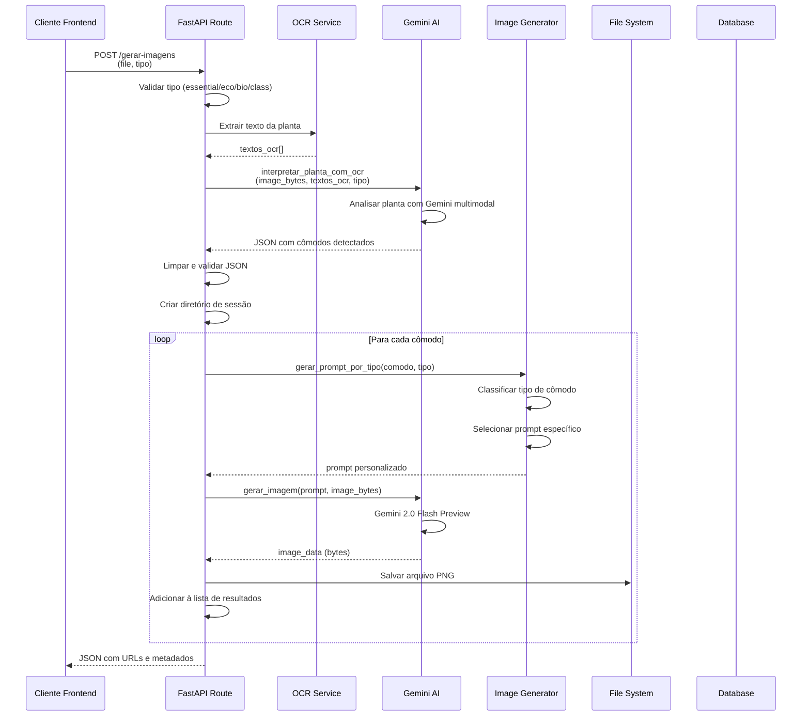
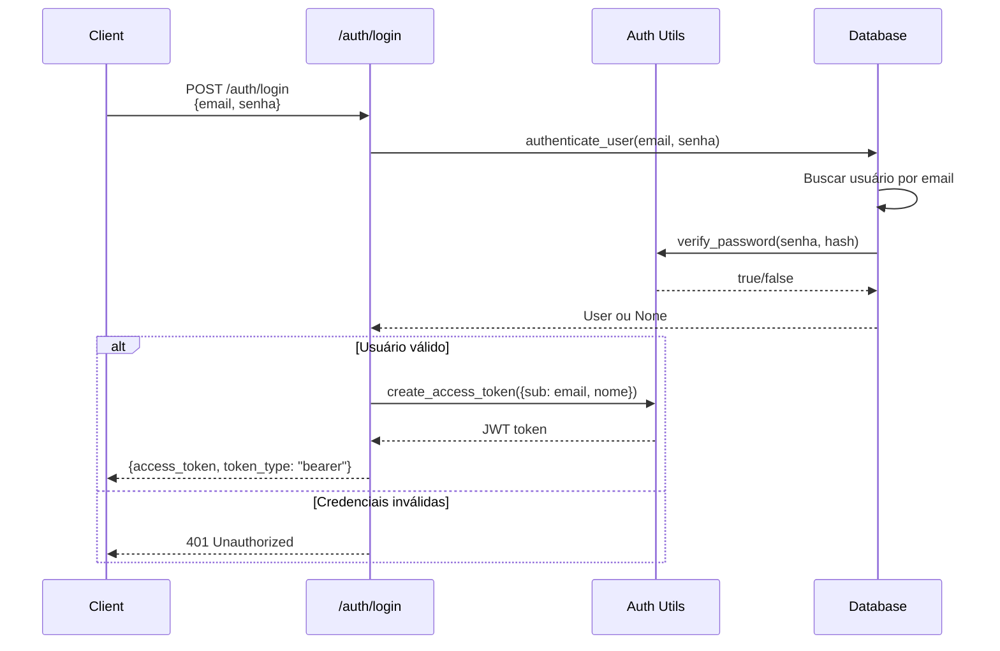

# Documentação Técnica - Backend MRV AI Preview

## 📋 Índice

1. [Visão Geral](#visão-geral)
2. [Arquitetura do Sistema](#arquitetura-do-sistema)
3. [Estrutura de Diretórios](#estrutura-de-diretórios)
4. [Fluxo de Processamento](#fluxo-de-processamento)
5. [Componentes Principais](#componentes-principais)
6. [Sistema de Autenticação](#sistema-de-autenticação)
7. [Banco de Dados](#banco-de-dados)
8. [APIs e Endpoints](#apis-e-endpoints)
9. [Integrações Externas](#integrações-externas)
10. [Configurações e Variáveis de Ambiente](#configurações-e-variáveis-de-ambiente)
11. [Segurança](#segurança)
12. [Tratamento de Erros](#tratamento-de-erros)

---

## Visão Geral

O **MRV AI Preview Backend** é uma API REST desenvolvida em **FastAPI (Python 3.12+)** que processa plantas arquitetônicas e gera visualizações fotorrealistas de apartamentos usando Inteligência Artificial.

### Funcionalidades Principais

- **OCR (Reconhecimento Óptico de Caracteres)**: Extração de texto de plantas baixas usando EasyOCR
- **Interpretação via IA**: Análise de plantas usando Google Gemini para identificar cômodos, dimensões e localizações
- **Geração de Imagens**: Criação de previews fotorrealistas em alta definição usando Gemini 2.0 Flash Preview
- **Sistema de Autenticação**: Login/registro com JWT e SQLite
- **Gestão de Arquivos**: Organização automática de imagens geradas por sessão
- **Categorias de Apartamentos**: Suporte para 4 tipos (Essential, Eco, Bio, Class) com estilos específicos

### Tecnologias Utilizadas

- **Framework**: FastAPI 0.116.1+
- **IA**: Google Gemini AI (gemini-2.5-flash, gemini-2.5-flash-image-preview)
- **OCR**: EasyOCR 1.7.2+
- **Autenticação**: JWT (python-jose), bcrypt (passlib)
- **Banco de Dados**: SQLite com SQLAlchemy 2.0+
- **Processamento de Imagens**: Pillow 11.3.0+
- **Servidor**: Uvicorn 0.35.0+

---

## Arquitetura do Sistema

### Diagrama de Arquitetura

```
┌─────────────────────────────────────────────────────────────┐
│                        CLIENTE (Frontend)                    │
│                    (Next.js - localhost:3000)                │
└───────────────────────┬─────────────────────────────────────┘
                        │ HTTP/REST
                        │
┌───────────────────────▼─────────────────────────────────────┐
│                    FASTAPI BACKEND                            │
│                  (localhost:8000)                             │
│                                                               │
│  ┌──────────────┐  ┌──────────────┐  ┌──────────────┐      │
│  │   API Routes │  │  Auth System │  │  Middleware   │      │
│  │              │  │              │  │  (CORS, JWT)  │      │
│  └──────┬───────┘  └──────┬───────┘  └──────┬───────┘      │
│         │                 │                 │                │
│  ┌──────▼─────────────────▼─────────────────▼───────┐      │
│  │              Core Business Logic                    │      │
│  │  ┌──────────┐  ┌──────────┐  ┌──────────┐        │      │
│  │  │   OCR    │  │    AI    │  │  Image   │        │      │
│  │  │ Service  │  │ Service  │  │ Generator│        │      │
│  │  └────┬─────┘  └────┬─────┘  └────┬─────┘        │      │
│  └───────┼──────────────┼─────────────┼──────────────┘      │
│          │              │             │                       │
└──────────┼──────────────┼─────────────┼───────────────────────┘
           │              │             │
           │              │             │
┌──────────▼──────────────▼─────────────▼───────────────────┐
│              EXTERNAL SERVICES                              │
│  ┌────────────────────────────────────────────────────┐   │
│  │         Google Gemini AI API                        │   │
│  │  - gemini-2.5-flash (texto)                        │   │
│  │  - gemini-2.5-flash-image-preview (imagens)        │   │
│  └────────────────────────────────────────────────────┘   │
│                                                           │
│  ┌────────────────────────────────────────────────────┐   │
│  │              SQLite Database                        │   │
│  │  - auth.db (usuários)                               │   │
│  │  - user_plantas, image_sessions, generated_images  │   │
│  └────────────────────────────────────────────────────┘   │
│                                                           │
│  ┌────────────────────────────────────────────────────┐   │
│  │         File System Storage                         │   │
│  │  - generated_images/                                │   │
│  │    └── YYYYMMDD_HHMMSS_sessionid/                  │   │
│  │        ├── comodo_1_sala.png                        │   │
│  │        ├── comodo_2_quarto.png                     │   │
│  │        └── ...                                      │   │
│  └────────────────────────────────────────────────────┘   │
└───────────────────────────────────────────────────────────┘
```

### Padrão de Arquitetura

O sistema segue uma arquitetura em **camadas** com separação clara de responsabilidades:

1. **Camada de Apresentação (API)**: Rotas FastAPI, validação de entrada, formatação de saída
2. **Camada de Negócio (Core)**: Lógica de processamento, OCR, interpretação, geração de imagens
3. **Camada de Dados (Database)**: Modelos SQLAlchemy, serviços de persistência
4. **Camada de Integração (External)**: APIs externas (Gemini), sistema de arquivos

---

## Estrutura de Diretórios

```
mrv-ai-preview-back/
├── main.py                          # Ponto de entrada da aplicação
├── init_db.py                       # Script de inicialização do banco
├── pyproject.toml                    # Dependências e configuração (UV)
├── uv.lock                          # Lock file do UV
├── auth.db                          # Banco SQLite (usuários)
├── generated_images/                # Imagens geradas organizadas por sessão
│   └── YYYYMMDD_HHMMSS_sessionid/
│       ├── comodo_1_sala.png
│       └── ...
└── utils/                           # Módulos principais
    ├── api/                         # Camada de API
    │   ├── main.py                  # Configuração FastAPI, CORS, rotas
    │   └── routes/
    │       ├── image_generation.py  # POST /gerar-imagens
    │       └── ocr.py               # POST /ocr
    │
    ├── auth/                        # Sistema de autenticação
    │   ├── models.py                # Modelo User (SQLAlchemy)
    │   ├── routes.py                # POST /auth/login, /auth/register
    │   ├── schemas.py               # Pydantic schemas (validação)
    │   ├── utils.py                 # JWT, hash de senhas
    │   └── middleware.py            # Dependencies para autenticação
    │
    ├── core/                        # Lógica de negócio
    │   ├── ocr/
    │   │   └── ocr_service.py       # Serviço EasyOCR
    │   │
    │   ├── ai/
    │   │   ├── gemini_service.py    # Integração com Gemini AI
    │   │   └── interpreter_plan.py  # Interpretação de plantas
    │   │
    │   └── image_generation/
    │       ├── image_service.py     # Orquestração de geração
    │       ├── prompt_essential.py  # Prompts para tipo Essential
    │       ├── prompt_eco.py         # Prompts para tipo Eco
    │       ├── prompt_bio.py        # Prompts para tipo Bio
    │       └── prompt_class.py      # Prompts para tipo Class
    │
    ├── database/                    # Camada de dados
    │   ├── db_service.py            # Configuração SQLAlchemy
    │   ├── image_models.py          # Modelos: UserPlanta, ImageSession, GeneratedImage
    │   └── image_service.py        # Serviços de persistência
    │
    ├── shared/                      # Utilitários compartilhados
    │   ├── config.py                # Configurações centralizadas
    │   └── json_utils.py            # Utilitários para JSON
    │
    └── tests/                       # Testes
        └── test_api_key.py          # Testes de API
```

---

## Fluxo de Processamento

### Fluxo Principal: Geração de Imagens



### Detalhamento do Fluxo

#### 1. Recebimento da Requisição

**Endpoint**: `POST /gerar-imagens`

**Parâmetros**:
- `file`: UploadFile (imagem da planta baixa)
- `tipo`: str (essential, eco, bio, class)

**Validações Iniciais**:
- Verificar se o tipo é válido
- Converter imagem para numpy array para OCR
- Manter bytes originais para geração de imagens

#### 2. Processamento OCR

```python
# Extração de texto usando EasyOCR
result = reader.readtext(image_np)
textos_ocr = [r[1] for r in result]
```

- **EasyOCR** é inicializado com suporte para português e inglês
- Retorna lista de tuplas: `[(bbox, texto, confiança), ...]`
- Apenas os textos são extraídos para análise

#### 3. Interpretação da Planta via IA

**Função**: `interpreter_plan.interpretar_planta_com_ocr()`

**Processo**:
1. Monta prompt estruturado com textos OCR e tipo de apartamento
2. Envia imagem + prompt para Gemini multimodal
3. Recebe JSON com cômodos identificados:

```json
{
  "cômodos": [
    {
      "nome": "Sala de Estar",
      "dimensões": {
        "largura": 450,
        "comprimento": 320
      },
      "localização": "centro",
      "notas": "Sofa against north wall, TV on south wall..."
    }
  ]
}
```

4. Limpa JSON removendo markdown delimiters
5. Valida estrutura e extrai lista de cômodos

#### 4. Geração de Imagens por Cômodo

Para cada cômodo detectado:

**4.1. Classificação do Tipo de Cômodo**

```python
tipo_comodo = classificar_comodo(comodo)
# Retorna: quarto_pequeno, quarto_casal, sala, banheiro, cozinha, etc.
```

**4.2. Geração de Prompt Específico**

Baseado no tipo de apartamento e tipo de cômodo, seleciona função de prompt:

- `ESSENTIAL`: `prompt_essential.py`
- `ECO`: `prompt_eco.py`
- `BIO`: `prompt_bio.py`
- `CLASS`: `prompt_class.py`

Cada prompt inclui:
- Dimensões do cômodo
- Localização na planta
- Notas sobre mobiliário (do OCR/LLM)
- Especificações de estilo e acabamento

**4.3. Geração da Imagem**

**Função**: `gemini_service.gerar_imagem()`

**Processo**:
1. Prepara prompt com especificações de **ULTRA ALTA QUALIDADE**
2. Converte bytes da planta para PIL Image
3. Aplica upscaling mínimo se necessário (mínimo 512px)
4. Envia para Gemini 2.0 Flash Preview com configurações:
   - `max_output_tokens`: 8192
   - `temperature`: 0.1 (consistência)
   - `candidate_count`: 1
   - `response_modalities`: ['TEXT', 'IMAGE']

5. **Retry Logic**: Até 8 tentativas com delay progressivo (5s → 80s) para erros 503/500

6. Extrai imagem binária da resposta

**4.4. Salvamento**

- Sanitiza nome do cômodo para nome de arquivo seguro
- Cria arquivo: `comodo_{i+1}_{nome_sanitizado}.png`
- Salva em: `generated_images/{timestamp}_{session_id}/`
- Retorna metadados: URL relativa, tamanho, dimensões

#### 5. Resposta Final

```json
{
  "modo": "arquivos_hd",
  "tipo": "ESSENTIAL",
  "quantidade_comodos": 5,
  "session_id": "20240914_203708_10300cc8",
  "diretorio": "/path/to/generated_images/...",
  "configuracao": {
    "alta_qualidade": true,
    "resolucao": "MÁXIMA DISPONÍVEL NO MODELO",
    "qualidade": "ULTRA ALTA DEFINIÇÃO - sem compressão",
    "rendering": "Fotorrealístico com ray tracing completo",
    "anti_aliasing": "Máximo",
    "max_tentativas": 8,
    "delay_progressivo": "5s até 80s",
    "formato": "PNG sem compressão",
    "tipo_prompt": "ESSENTIAL"
  },
  "resultado": [
    {
      "comodo": "Sala de Estar",
      "prompt": "...",
      "arquivo": "/path/to/file.png",
      "tamanho_bytes": 2048576,
      "url_relativa": "/imagens/20240914_203708_10300cc8/comodo_1_sala_estar.png",
      "dimensoes": {"largura": "4.5m", "altura": "3.2m"},
      "localizacao": "centro",
      "notas": "..."
    }
  ]
}
```

---

## Componentes Principais

### 1. API Routes (`utils/api/`)

#### `main.py` - Configuração Principal

**Responsabilidades**:
- Inicialização da aplicação FastAPI
- Configuração de CORS
- Montagem de rotas estáticas para imagens
- Criação de tabelas do banco

**CORS Configurado**:
```python
allow_origins=["http://localhost:3000"]
allow_credentials=True
allow_methods=["*"]
allow_headers=["*"]
```

**Static Files**:
- Monta `/imagens` para servir `generated_images/`

#### `routes/image_generation.py` - Geração de Imagens

**Endpoint**: `POST /gerar-imagens`

**Fluxo**:
1. Recebe arquivo e tipo
2. Valida tipo de apartamento
3. Executa OCR
4. Interpreta planta via LLM
5. Gera imagens para cada cômodo
6. Salva arquivos e retorna metadados

**Função de Sanitização**:
- Remove caracteres problemáticos de nomes de arquivo
- Converte para lowercase
- Remove underscores múltiplos

#### `routes/ocr.py` - Processamento OCR

**Endpoint**: `POST /ocr`

**Funcionalidade**:
- Extrai texto da planta usando EasyOCR
- Chama interpretação via LLM
- Retorna texto extraído e interpretação

### 2. Core Services (`utils/core/`)

#### OCR Service (`ocr/ocr_service.py`)

**Classe**: `OCRService`

**Métodos**:
- `extract_text_from_image(image_data: bytes)`: Extrai texto de bytes
- `extract_text_from_file(file_path: str)`: Extrai texto de arquivo

**Inicialização**:
```python
reader = easyocr.Reader(['pt', 'en'], gpu=False)
```

#### AI Service (`ai/gemini_service.py`)

**Modelos Configurados**:
- `modelo_texto`: `gemini-2.5-flash` (texto)
- `modelo_imagem`: `gemini-2.5-flash-image-preview` (imagens)
- `modelo_multimodal`: `gemini-2.5-flash` (multimodal)

**Funções Principais**:

**`interpretar_texto(prompt, history=None)`**:
- Usa modelo de texto para análise
- Suporta histórico de conversa

**`gerar_imagem(prompt, image_bytes, max_retries=8)`**:
- Gera imagem em ultra alta qualidade
- Requer imagem de referência (planta)
- Retry automático com delay progressivo
- Retorna bytes da imagem PNG

**`classificar_tipo_comodo(prompt)`**:
- Classifica tipo de cômodo via texto

**`interpretar_planta_com_imagem(prompt, image_bytes)`**:
- Interpretação multimodal (imagem + texto)

**Configuração de API Key**:
```python
GEMINI_API_KEY = os.getenv("GEMINI_API_KEY_LUCAS")
```

#### Interpreter Plan (`ai/interpreter_plan.py`)

**Função**: `interpretar_planta_com_ocr(image_bytes, texto_ocr, tipo_apartamento)`

**Processo**:
1. Monta prompt estruturado com:
   - Textos extraídos por OCR
   - Tipo de apartamento
   - Instruções para retornar JSON específico

2. Chama `interpretar_planta_com_imagem()` com imagem + prompt

3. Retorna JSON com cômodos identificados

**Schema Esperado**:
```json
{
  "cômodos": [
    {
      "nome": "string",
      "dimensões": {
        "largura": number,
        "comprimento": number
      },
      "localização": "string",
      "notas": "string (em inglês)"
    }
  ]
}
```

#### Image Service (`image_generation/image_service.py`)

**Funções Principais**:

**`classificar_comodo(comodo: dict)`**:
- Classifica tipo de cômodo usando Gemini
- Retorna: `quarto_pequeno`, `quarto_casal`, `sala`, `banheiro`, `cozinha`, etc.

**`gerar_prompt_por_tipo(comodo: dict, tipo_apartamento: str)`**:
- Seleciona função de prompt baseada no tipo
- Importa módulo correto (`prompt_essential.py`, etc.)
- Chama função específica do tipo de cômodo
- Retorna prompt personalizado

**`gerar_imagens_para_comodos(lista_comodos, imagem_planta_bytes, tipo_apartamento)`**:
- Orquestra geração para múltiplos cômodos
- Retorna lista com imagens em base64 (não usado atualmente)

#### Prompt Modules

Cada módulo (`prompt_essential.py`, `prompt_eco.py`, `prompt_bio.py`, `prompt_class.py`) contém funções específicas por tipo de cômodo:

- `quarto_pequeno_*()`
- `quarto_casal_*()`
- `sala_*()`
- `banheiro_*()`
- `cozinha_*()`
- `area_privativa_*()`
- `varanda_*()` (apenas Essential)
- `generico_*()`

**Características por Tipo**:

- **ESSENTIAL**: Funcional, econômico, acabamentos básicos
- **ECO**: Sustentável, materiais naturais, tecnologia verde
- **BIO**: Biofílico, integração total com natureza, materiais orgânicos
- **CLASS**: Premium, luxuoso, acabamentos nobres, tecnologia de ponta

### 3. Database Services (`utils/database/`)

#### DB Service (`db_service.py`)

**Configuração SQLAlchemy**:
```python
DATABASE_URL = os.getenv("DATABASE_URL", "sqlite:///./auth.db")
engine = create_engine(DATABASE_URL, connect_args={"check_same_thread": False})
SessionLocal = sessionmaker(autocommit=False, autoflush=False, bind=engine)
```

**Dependency**: `get_db()`
- Gerencia ciclo de vida da sessão
- Rollback automático em erros
- Fechamento garantido

#### Image Models (`image_models.py`)

**Modelos Definidos**:

**`UserPlanta`**:
- Armazena plantas baixas enviadas
- Relacionamento: `user_id` → `User`
- Campos: nome, tipo_apartamento, planta_data (BLOB), OCR, interpretação LLM
- Hash MD5 para detectar duplicatas

**`ImageSession`**:
- Gerencia sessões de geração
- Relacionamento: `planta_id` → `UserPlanta`
- Campos: session_id, status, progresso, configurações
- Tracking: comodos_processados, comodos_sucesso, comodos_erro

**`GeneratedImage`**:
- Armazena imagens geradas
- Relacionamento: `session_id` → `ImageSession`
- Campos: imagem_data (BLOB), metadados, prompt usado, performance

**Funções Utilitárias**:
- `create_user_planta()`: Cria nova planta
- `create_image_session()`: Cria nova sessão
- `save_generated_image()`: Salva imagem gerada
- `get_user_plantas()`: Lista plantas do usuário
- `update_session_progress()`: Atualiza progresso

#### Image Service (`image_service.py`)

**Classe**: `ImageDatabaseService`

**Métodos Principais**:

- `create_planta_and_session()`: Cria planta e sessão
- `save_image()`: Salva imagem e atualiza progresso
- `get_user_plantas()`: Lista plantas
- `get_session_images()`: Lista imagens de sessão
- `get_image_data()`: Recupera bytes da imagem
- `delete_planta()`: Remove planta e dependências
- `get_user_stats()`: Estatísticas do usuário

---

## Sistema de Autenticação

### Arquitetura

- **Método**: JWT (JSON Web Tokens)
- **Algoritmo**: HS256
- **Hash de Senhas**: bcrypt (passlib)
- **Banco**: SQLite (`auth.db`)

### Componentes

#### Models (`auth/models.py`)

**Modelo `User`**:
```python
class User(Base):
    __tablename__ = "users"
    id = Column(Integer, primary_key=True)
    nome = Column(String(100))
    email = Column(String(100), unique=True, index=True)
    senha_hashed = Column(String(255))
```

**Funções**:
- `get_user_by_email()`: Busca usuário por email
- `authenticate_user()`: Valida credenciais

#### Schemas (`auth/schemas.py`)

**Pydantic Models**:

- `LoginRequest`: email, senha (min 6, max 100)
- `RegisterRequest`: nome (min 2, max 100), email, senha
- `TokenResponse`: access_token, token_type, expires_in
- `UserResponse`: id, nome, email

**Validações**:
- Email formatado
- Senha: 6-100 caracteres
- Nome: 2-100 caracteres, não vazio

#### Utils (`auth/utils.py`)

**Funções**:

**`hash_password(password: str)`**:
- Usa bcrypt via passlib
- Rounds configuráveis (padrão: 4 para dev, 12+ para produção)

**`verify_password(plain_password, hashed_password)`**:
- Verifica senha contra hash

**`create_access_token(data: dict, expires_delta=None)`**:
- Cria JWT com payload
- Expiração: `ACCESS_TOKEN_EXPIRE_MINUTES` (padrão: 60 min)
- Campos: `sub` (email), `nome`, `exp`, `iat`

**`decode_access_token(token: str)`**:
- Decodifica e valida JWT
- Verifica expiração
- Retorna payload ou None

**Configurações**:
```python
SECRET_KEY = os.getenv("JWT_SECRET_KEY", "dev-secret-key...")
ALGORITHM = "HS256"
ACCESS_TOKEN_EXPIRE_MINUTES = int(os.getenv("ACCESS_TOKEN_EXPIRE_MINUTES", "60"))
```

#### Middleware (`auth/middleware.py`)

**Dependencies FastAPI**:

**`get_current_user(credentials, db)`**:
- Extrai token do header `Authorization: Bearer <token>`
- Valida token
- Busca usuário no banco
- Retorna `User` ou levanta `HTTPException 401`

**`get_current_active_user(current_user)`**:
- Wrapper para usuário ativo (pode ser expandido)

**`get_current_user_optional(credentials, db)`**:
- Versão opcional (retorna `None` se não autenticado)

#### Routes (`auth/routes.py`)

**Endpoints**:

**`POST /auth/login`**:
1. Recebe `LoginRequest`
2. Autentica usuário
3. Gera JWT
4. Retorna `TokenResponse`

**`POST /auth/register`**:
1. Recebe `RegisterRequest`
2. Verifica se email já existe
3. Cria novo usuário com senha hasheada
4. Gera JWT
5. Retorna `TokenResponse`

### Fluxo de Autenticação



### Uso em Rotas Protegidas

```python
from utils.auth.middleware import get_current_user

@router.get("/protegida")
def rota_protegida(current_user: User = Depends(get_current_user)):
    return {"message": f"Olá, {current_user.nome}!"}
```

---

## Banco de Dados

### Estrutura

#### Tabela `users`

```sql
CREATE TABLE users (
    id INTEGER PRIMARY KEY,
    nome VARCHAR(100) NOT NULL,
    email VARCHAR(100) UNIQUE NOT NULL,
    senha_hashed VARCHAR(255) NOT NULL
);
```

**Índices**: `email` (único)

#### Tabela `user_plantas`

```sql
CREATE TABLE user_plantas (
    id INTEGER PRIMARY KEY,
    user_id INTEGER NOT NULL,
    nome_planta VARCHAR(200),
    tipo_apartamento VARCHAR(50) NOT NULL,
    planta_hash VARCHAR(64),
    planta_data BLOB,
    tamanho_bytes INTEGER,
    formato_original VARCHAR(10),
    total_comodos_detectados INTEGER DEFAULT 0,
    ocr_texto_extraido TEXT,
    interpretacao_llm TEXT,
    created_at DATETIME,
    updated_at DATETIME,
    status VARCHAR(50) DEFAULT 'processando',
    FOREIGN KEY (user_id) REFERENCES users(id)
);
```

**Índices**: `user_id`, `planta_hash`

#### Tabela `image_sessions`

```sql
CREATE TABLE image_sessions (
    id INTEGER PRIMARY KEY,
    session_id VARCHAR(100) UNIQUE NOT NULL,
    planta_id INTEGER NOT NULL,
    total_comodos INTEGER NOT NULL,
    comodos_processados INTEGER DEFAULT 0,
    comodos_sucesso INTEGER DEFAULT 0,
    comodos_erro INTEGER DEFAULT 0,
    status VARCHAR(50) DEFAULT 'em_progresso',
    alta_qualidade BOOLEAN DEFAULT TRUE,
    max_tentativas INTEGER DEFAULT 8,
    created_at DATETIME,
    updated_at DATETIME,
    tempo_processamento FLOAT,
    FOREIGN KEY (planta_id) REFERENCES user_plantas(id)
);
```

**Índices**: `session_id` (único), `planta_id`

#### Tabela `generated_images`

```sql
CREATE TABLE generated_images (
    id INTEGER PRIMARY KEY,
    session_id VARCHAR(100) NOT NULL,
    comodo_id INTEGER NOT NULL,
    nome_comodo VARCHAR(200) NOT NULL,
    nome_arquivo VARCHAR(255) NOT NULL,
    tipo_comodo VARCHAR(100),
    largura_cm FLOAT,
    comprimento_cm FLOAT,
    localizacao VARCHAR(200),
    imagem_data BLOB NOT NULL,
    tamanho_bytes INTEGER NOT NULL,
    formato VARCHAR(10) DEFAULT 'PNG',
    resolucao VARCHAR(20) DEFAULT 'MAX_QUALITY',
    prompt_usado TEXT,
    alta_qualidade BOOLEAN DEFAULT TRUE,
    qualidade_jpeg INTEGER DEFAULT 100,
    tempo_geracao FLOAT,
    tentativas_realizadas INTEGER DEFAULT 1,
    created_at DATETIME,
    url_relativa VARCHAR(500),
    arquivo_path VARCHAR(1000),
    FOREIGN KEY (session_id) REFERENCES image_sessions(session_id)
);
```

**Índices**: `session_id`, `comodo_id`

### Relacionamentos

```
User (1) ──→ (N) UserPlanta
UserPlanta (1) ──→ (N) ImageSession
ImageSession (1) ──→ (N) GeneratedImage
```

**Cascata**: Deletar `UserPlanta` remove automaticamente `ImageSession` e `GeneratedImage`

### Inicialização

**Script**: `init_db.py`

**Processo**:
1. Cria tabela `users` usando `User.metadata.create_all()`
2. Cria usuário de teste (se não existir):
   - Email: `test@mrv.com`
   - Senha: `123456`

**Comando**:
```bash
python init_db.py
```

---

## APIs e Endpoints

### Base URL

```
http://127.0.0.1:8000
```

### Endpoints Públicos

#### `POST /auth/register`

**Descrição**: Registrar novo usuário

**Request**:
```json
{
  "nome": "João Silva",
  "email": "joao@example.com",
  "senha": "senha123"
}
```

**Response** (200):
```json
{
  "access_token": "eyJhbGciOiJIUzI1NiIsInR5cCI6IkpXVCJ9...",
  "token_type": "bearer",
  "expires_in": 3600
}
```

**Erros**:
- `400`: Usuário já existe
- `422`: Validação falhou (email inválido, senha curta, etc.)

#### `POST /auth/login`

**Descrição**: Login de usuário

**Request**:
```json
{
  "email": "joao@example.com",
  "senha": "senha123"
}
```

**Response** (200):
```json
{
  "access_token": "eyJhbGciOiJIUzI1NiIsInR5cCI6IkpXVCJ9...",
  "token_type": "bearer",
  "expires_in": 3600
}
```

**Erros**:
- `401`: Email ou senha incorretos
- `422`: Validação falhou

### Endpoints de Processamento

#### `POST /gerar-imagens`

**Descrição**: Processa planta e gera imagens dos cômodos

**Autenticação**: Não requerida (atualmente)

**Request** (multipart/form-data):
- `file`: UploadFile (imagem da planta)
- `tipo`: str (essential, eco, bio, class)

**Response** (200):
```json
{
  "modo": "arquivos_hd",
  "tipo": "ESSENTIAL",
  "quantidade_comodos": 5,
  "session_id": "20240914_203708_10300cc8",
  "diretorio": "/path/to/generated_images/...",
  "configuracao": {
    "alta_qualidade": true,
    "resolucao": "MÁXIMA DISPONÍVEL NO MODELO",
    "qualidade": "ULTRA ALTA DEFINIÇÃO - sem compressão",
    "rendering": "Fotorrealístico com ray tracing completo",
    "anti_aliasing": "Máximo",
    "max_tentativas": 8,
    "delay_progressivo": "5s até 80s",
    "formato": "PNG sem compressão",
    "tipo_prompt": "ESSENTIAL"
  },
  "resultado": [
    {
      "comodo": "Sala de Estar",
      "prompt": "Create a realistic 3D image...",
      "arquivo": "/path/to/comodo_1_sala_estar.png",
      "tamanho_bytes": 2048576,
      "url_relativa": "/imagens/20240914_203708_10300cc8/comodo_1_sala_estar.png",
      "dimensoes": {
        "largura": 450,
        "comprimento": 320
      },
      "localizacao": "centro",
      "notas": "Sofa against north wall..."
    }
  ]
}
```

**Erros**:
- `400`: Tipo inválido
- `500`: Erro no processamento (OCR, LLM, geração)

#### `POST /ocr`

**Descrição**: Extrai texto e interpreta planta (sem gerar imagens)

**Request** (multipart/form-data):
- `file`: UploadFile
- `tipo`: str

**Response** (200):
```json
{
  "interpretacao_llm": "{'cômodos': [...]}",
  "tipo": "essential"
}
```

### Endpoints Estáticos

#### `GET /imagens/{session_id}/{filename}`

**Descrição**: Serve imagens geradas

**Exemplo**:
```
GET /imagens/20240914_203708_10300cc8/comodo_1_sala_estar.png
```

**Resposta**: Arquivo PNG binário

---

## Integrações Externas

### Google Gemini AI

#### Configuração

**API Key**: `GEMINI_API_KEY_LUCAS` (variável de ambiente)

**Modelos Utilizados**:

1. **`gemini-2.5-flash`**:
   - Texto e multimodal
   - Interpretação de plantas
   - Classificação de cômodos

2. **`gemini-2.5-flash-image-preview`**:
   - Geração de imagens
   - Requer imagem de referência
   - Ultra alta qualidade

#### Cliente

**Biblioteca**: `google.genai` (nova API) ou `google.generativeai` (legacy)

**Inicialização**:
```python
from google import genai as genai_new
client = genai_new.Client(api_key=GEMINI_API_KEY)
```

#### Rate Limiting e Retry

**Estratégia**:
- Máximo 8 tentativas
- Delay progressivo: 5s → 10s → 15s → 25s → 35s → 50s → 65s → 80s
- Aplica apenas para erros 503 (overloaded) e 500 (internal)
- Outros erros falham imediatamente

**Implementação**:
```python
for attempt in range(max_retries):
    try:
        # Chamada à API
        ...
    except Exception as e:
        if "503" in str(e) or "500" in str(e):
            if attempt < max_retries - 1:
                delay = base_delays[min(attempt, len(base_delays) - 1)]
                time.sleep(delay)
                continue
        raise
```

### EasyOCR

**Configuração**:
```python
reader = easyocr.Reader(['pt', 'en'], gpu=False)
```

**Idiomas**: Português e Inglês

**GPU**: Desabilitada (CPU apenas)

**Uso**:
```python
result = reader.readtext(image_np)
# Retorna: [(bbox, texto, confiança), ...]
```

---

## Configurações e Variáveis de Ambiente

### Variáveis Obrigatórias

#### `.env`

```env
# Google Gemini AI
GEMINI_API_KEY_LUCAS=sua_api_key_aqui

# JWT
JWT_SECRET_KEY=sua_chave_secreta_jwt
ACCESS_TOKEN_EXPIRE_MINUTES=60

# Banco de Dados
DATABASE_URL=sqlite:///./auth.db

# Configurações da API
HOST=127.0.0.1
PORT=8000
DEBUG=True

# Bcrypt (opcional)
BCRYPT_ROUNDS=4  # 4 para dev, 12+ para produção
```

### Configurações Padrão

**Se variáveis não definidas**:

- `JWT_SECRET_KEY`: `"dev-secret-key-change-this-in-production"`
- `ACCESS_TOKEN_EXPIRE_MINUTES`: `60`
- `DATABASE_URL`: `"sqlite:///./auth.db"`
- `BCRYPT_ROUNDS`: `4`
- `SQLITE_ECHO`: `false`

### Configurações de Qualidade

**Hardcoded em `image_generation.py`**:

```python
configuracao = {
    "alta_qualidade": True,
    "resolucao": "MÁXIMA DISPONÍVEL NO MODELO",
    "qualidade": "ULTRA ALTA DEFINIÇÃO - sem compressão",
    "rendering": "Fotorrealístico com ray tracing completo",
    "anti_aliasing": "Máximo",
    "max_tentativas": 8,
    "delay_progressivo": "5s até 80s",
    "formato": "PNG sem compressão"
}
```

### CORS

**Configurado em `main.py`**:

```python
allow_origins=["http://localhost:3000", "http://127.0.0.1:3000"]
allow_credentials=True
allow_methods=["*"]
allow_headers=["*"]
```

---

## Segurança

### Autenticação

- **JWT**: Tokens assinados com HS256
- **Senhas**: Hash bcrypt com salt
- **Expiração**: Tokens expiram após 60 minutos (configurável)

### Validação de Entrada

- **Pydantic**: Validação automática de schemas
- **Email**: Formato validado
- **Senha**: Mínimo 6 caracteres
- **Tipo de Apartamento**: Whitelist (essential, eco, bio, class)

### Sanitização

- **Nomes de Arquivo**: Caracteres problemáticos removidos
- **SQL Injection**: Prevenido por SQLAlchemy (ORM)
- **XSS**: Não aplicável (API JSON)

### Segredos

- **API Keys**: Armazenadas em variáveis de ambiente
- **JWT Secret**: Deve ser alterado em produção
- **Senhas**: Nunca logadas ou retornadas

### Recomendações para Produção

1. **JWT Secret**: Usar chave forte e aleatória
2. **HTTPS**: Sempre usar TLS/SSL
3. **Rate Limiting**: Implementar limites de requisição
4. **CORS**: Restringir origens permitidas
5. **Bcrypt Rounds**: Aumentar para 12+ rounds
6. **Logs**: Não logar dados sensíveis
7. **Database**: Considerar PostgreSQL para produção

---

## Tratamento de Erros

### Estratégias

#### 1. Validação de Entrada

**FastAPI + Pydantic**:
- Validação automática de tipos
- Mensagens de erro estruturadas
- Status 422 para validação falha

#### 2. Retry em APIs Externas

**Gemini API**:
- Até 8 tentativas
- Delay progressivo
- Apenas para erros 503/500

#### 3. Tratamento de Exceções

**Padrão**:
```python
try:
    # Operação
    ...
except SpecificException as e:
    return {"erro": str(e), "detalhes": ...}
except Exception as e:
    logging.error(f"Erro inesperado: {e}")
    return {"erro": "Erro interno do servidor"}
```

#### 4. Logging

**Níveis**:
- `INFO`: Operações normais
- `WARNING`: Situações anômalas
- `ERROR`: Erros que requerem atenção

**Exemplo**:
```python
import logging
logging.error(f"Erro ao gerar imagem: {e}")
```

### Códigos de Status HTTP

- **200**: Sucesso
- **400**: Bad Request (tipo inválido, etc.)
- **401**: Unauthorized (token inválido/expirado)
- **422**: Validation Error (Pydantic)
- **500**: Internal Server Error (erro não tratado)

### Mensagens de Erro

**Formato Padrão**:
```json
{
  "erro": "Descrição do erro",
  "detalhes": "Informações adicionais (opcional)"
}
```

**Exemplos**:
```json
{
  "erro": "Tipo de apartamento 'invalid' inválido. Tipos permitidos: ['essential', 'eco', 'bio', 'class']",
  "tipos_disponveis": ["essential", "eco", "bio", "class"]
}
```

```json
{
  "erro": "Nenhum cômodo encontrado na interpretação da planta."
}
```

---

## Execução e Deploy

### Desenvolvimento

**Iniciar servidor**:
```bash
python main.py
```

**Ou com uvicorn diretamente**:
```bash
uvicorn utils.api.main:app --host 127.0.0.1 --port 8000 --reload
```

**Inicializar banco**:
```bash
python init_db.py
```

### Docker

**Dockerfile** (exemplo):
```dockerfile
FROM python:3.12-slim

WORKDIR /app

# Instalar dependências do sistema
RUN apt-get update && apt-get install -y \
    libgl1-mesa-glx \
    libglib2.0-0 \
    && rm -rf /var/lib/apt/lists/*

# Instalar UV e dependências
COPY pyproject.toml uv.lock ./
RUN pip install uv
RUN uv sync --frozen

# Copiar código
COPY . .

# Criar diretórios
RUN mkdir -p generated_images

EXPOSE 8000

CMD ["uv", "run", "uvicorn", "utils.api.main:app", "--host", "0.0.0.0", "--port", "8000"]
```

**Build e Run**:
```bash
docker build -t mrv-ai-backend .
docker run -p 8000:8000 -v $(pwd)/generated_images:/app/generated_images -v $(pwd)/.env:/app/.env mrv-ai-backend
```

---

## Observações Finais

### Limitações Conhecidas

1. **Autenticação Opcional**: Rotas de geração não requerem autenticação atualmente
2. **SQLite**: Adequado para desenvolvimento, considerar PostgreSQL para produção
3. **Armazenamento**: Imagens salvas em sistema de arquivos (não escalável)
4. **Rate Limiting**: Não implementado
5. **Cache**: Não implementado

### Melhorias Futuras

1. **Autenticação Obrigatória**: Proteger todas as rotas
2. **Rate Limiting**: Implementar limites por usuário/IP
3. **Cache**: Cachear interpretações de plantas similares
4. **Queue System**: Processar gerações em background (Celery, etc.)
5. **Storage**: Migrar para S3/Cloud Storage
6. **Monitoring**: Adicionar métricas e alertas
7. **Testes**: Expandir cobertura de testes

---

**Documentação gerada em**: 2024  
**Versão do Backend**: 0.1.0  
**Python**: 3.12+  
**FastAPI**: 0.116.1+

